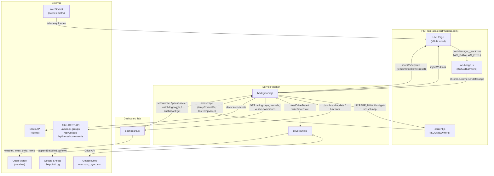

# Chrome Dashboard Extension — Architecture & Feature Map

## File Roles

| File | Role |
|------|------|
| `background.js` | Service worker: telemetry processor, watchdog engine, Drive sync coordinator |
| `dashboard.js` | Main UI: vessel grid, setpoint controls, issue filters, kiosk mode |
| `content.js` | HMI scraper: reads temp-control switch state from the Atlas HMI page |
| `ws-bridge.js` | Message relay: bridges MAIN-world WebSocket events to the service worker |
| `drive-sync.js` | Google APIs: Drive file read/write, Sheets setpoint log, JWT auth |

---

## Architecture Diagram



---

## Feature Breakdown

### Vessel Monitoring (`dashboard.js`)
- Real-time vessel grid: 13 columns × 3 rows of cards
- Status bubbles per card: Running / Off / Stopped / Fault
- Telemetry per card: process temp, airflow, pressure, motor angle, mass
- Issue severity scoring across 5 types: motor, temp, airflow, pressure, probe delta
- Fleet sparkline: 30-minute rolling alarm-count trend chart at bottom of screen

### Setpoint Control (`dashboard.js` + `background.js`)
- Click any vessel card to open a setpoint popup
- Controls: temp (°F), motor speed (R/hr), blower airflow (l/min), temp-ctrl on/off
- Commands are injected silently into the HMI WebSocket — no UI clicking required
- Multi-step sequencing with delays (e.g., enable temp-ctrl first, then set target temp)

### Watchdog Automation Engine (`background.js`)
- Runs every 2 minutes on the designated host machine (192.168.50.176)
- Escalating recovery sequence per vessel:
  1. Valve fault or mixer faulted → fault-reset + restore motor speed
  2. Motor stopped → bump speed, then fault-reset, then full rack reset
  3. Temp control off → re-enable at configured setpoint (with safety guards)
  4. Blower off → resend airflow setpoint (guards: declog active, pressure high)
- Skips intentionally paused racks
- Logs every action and setpoint send to Google Sheets (72-hr rolling window)

### Cross-Machine Sync (`drive-sync.js`)
- `watchdog_sync.json` on Google Drive tracks: enabled/disabled, who changed it, when
- Any dashboard tab on any machine can toggle watchdog; state syncs within ~1 min
- JWT authentication via Google service account (credentials in `chrome.storage.local`)

### Rack Controls (`dashboard.js` + `background.js`)
- Pause individual rack column, pause all racks, restart all, emergency stop
- Rack pause state is scraped from the HMI footer every 5 minutes or on demand

### Kiosk Mode (`dashboard.js`)
- Full-screen display that auto-cycles through: weather, trivia, jokes, news, Slack tickets
- Dynamic animated backgrounds matching weather type (rain streaks, lightning, fog, stars)
- Fleet sparkline and attention strip stay visible at the bottom at all times

### Issue Filtering (`dashboard.js`)
- Toggle to show only vessels with active problems
- Filter chips: Motor / Temp / Airflow / Pressure / Probe Delta
- Vessel search bar with card highlighting

### Options / Setup (`options.html` + `options.js`)
- First-time setup page for: Google service account (email + private key), Slack bot token
- All credentials stored locally in Chrome — never synced to a Google account

---

## Data Flow Summary

```
Live telemetry path:
  HMI WebSocket → (wrapped by background.js hook) → ws-bridge.js
  → background.js (parses + stores state) → dashboard.js (renders cards)

Setpoint write path:
  dashboard.js (popup) → background.js → HMI WebSocket (injected command)
  → drive-sync.js → Google Sheets log

Watchdog sync path:
  background.js (every 2 min tick) → drive-sync.js → Google Drive JSON
  ← any dashboard on any machine can read/write the same file

HMI temp-control scrape path:
  content.js (MutationObserver on HMI panel) → background.js → dashboard.js
```
